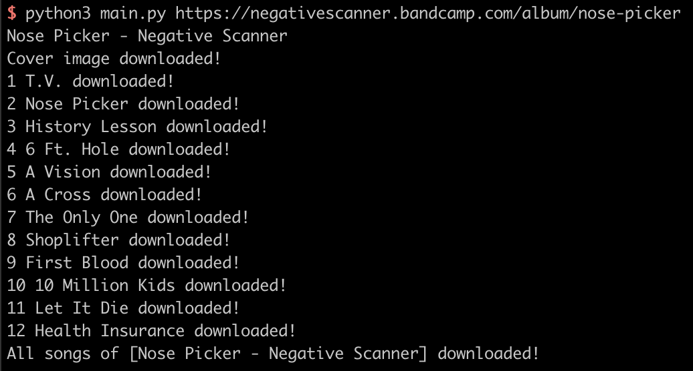
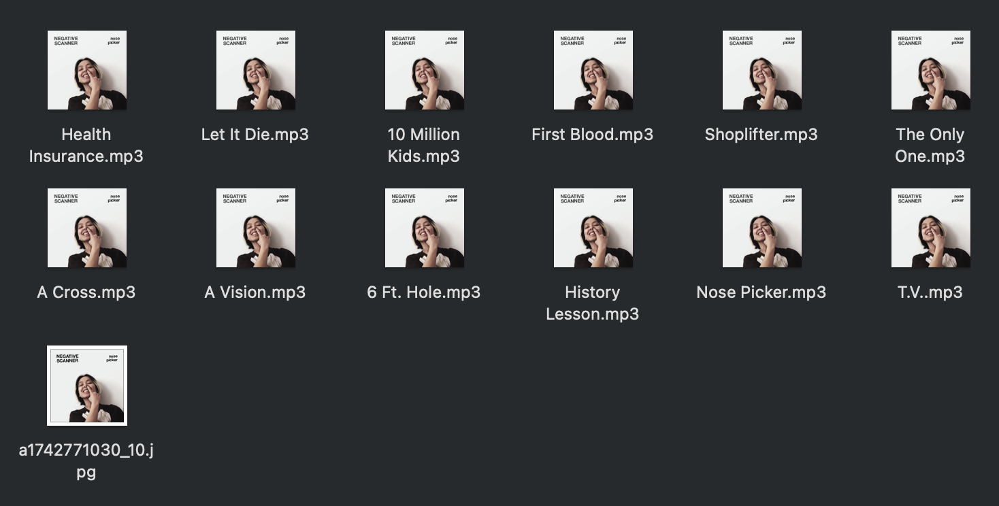

# bandcamp-dl

Download songs on Bandcamp by album.

Based on [Beautifulsoup4](https://www.crummy.com/software/BeautifulSoup/bs4/doc/)(to parse html) and [mutagen](https://mutagen.readthedocs.io/en/latest/)(to modify ID3 of songs).

Songs will be downaloaded with album cover and track number wrote in song's ID3 info. Album cover image is saved as a jpg file together.

```bash
# install dependency
python3 -m pip install beautifulsoup4
python3 -m pip install mutagen

# download album
python3 main.py https://wearefazi.bandcamp.com/album/running-horse
```



